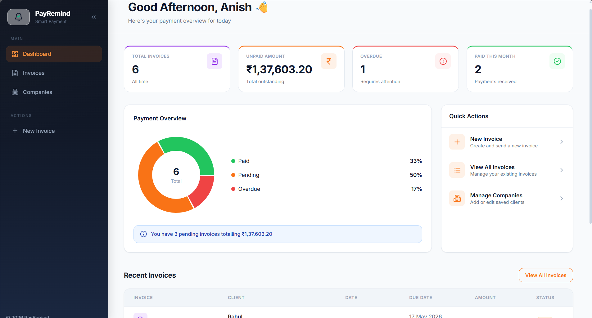
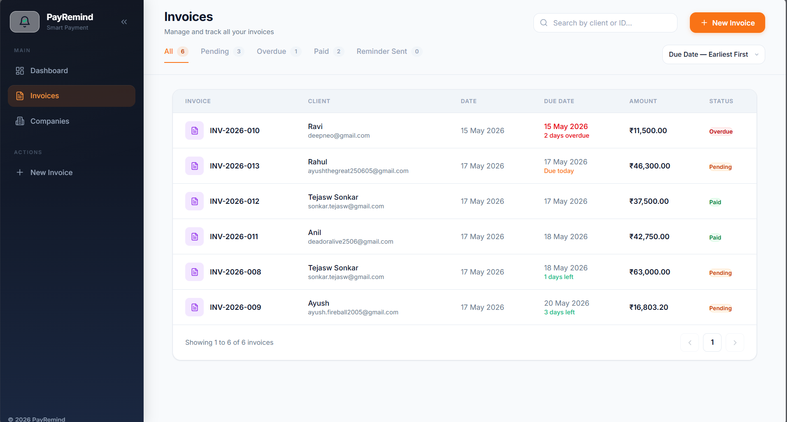
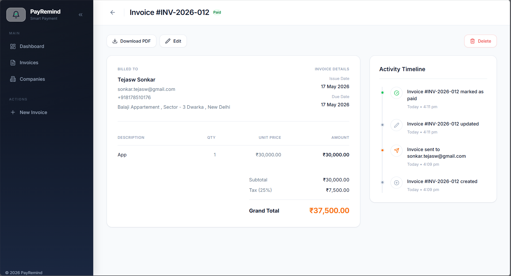
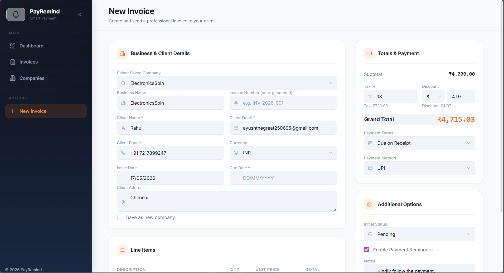
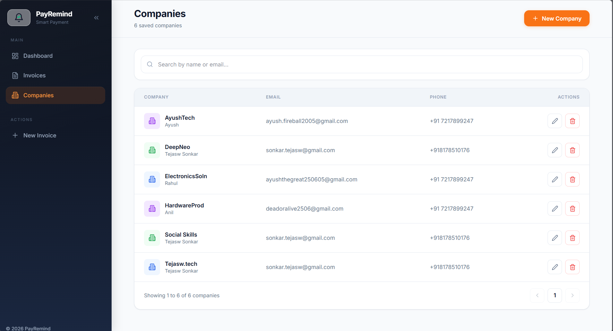

# 📊 PayRemind — Smart Invoicing & Auto-Reminders

> **Smart invoicing and payment reminder system for small businesses.**
> Built with genuine care to bridge cash flow gaps, eliminate repetitive client invoicing chores, and keep payments on track.

PayRemind is a premium, responsive, dark-themed SaaS invoicing platform that transforms how small business owners handle client billing and follow-ups. I designed this application to turn a manual, friction-filled task into a streamlined, high-performance serverless workflow. By shifting from a legacy local SQLite database to a cloud-persistent serverless Firebase stack, PayRemind guarantees data integrity, provides beautiful client-side A4 PDF invoice generations, and automates payment chasing with an asynchronous email system.

---

## 🛠️ Tech Stack & Dependencies

To make PayRemind lightning-fast, secure, and visually outstanding, I selected tools that play perfectly together in a modern, scalable architecture:

| Layer / Dependency | Technology | Why It Was Chosen & How It Helps |
| :--- | :--- | :--- |
| **Core Framework** | React 18 + Vite | React 18 provides reactive UI state updates and clean component lifecycles, while Vite ensures instant Hot Module Replacement (HMR) during development and tree-shaked, optimized static builds. |
| **Styling & Aesthetics** | Tailwind CSS + Custom HSL Variables | Tailwind handles utility-first layouts, while custom CSS variables tied to a persistent dark/light toggle in `localStorage` deliver premium, carefully tuned dark and light themes. |
| **Cloud Database** | Firebase Firestore (NoSQL) | Serves as a secure, cloud-persistent database. It supports real-time collections, deep subcollection hierarchy, and atomic transaction routines. |
| **Mail Services** | Firebase Trigger Email Extension + SendGrid SMTP | Offloads email routing securely to the cloud. Instead of exposing SMTP keys client-side, the app writes structured docs to a `mail` collection that a background extension dispatches securely. |
| **PDF Generation** | jsPDF (v4) | Renders clean, high-fidelity A4 document structures purely in the client browser, maintaining zero server overhead and allowing instantaneous client downloads. |
| **Data Visualization** | Recharts | Renders interactive, responsive dashboard charts (such as our payment distribution donut) with custom hover states and transitions. |
| **Calendar Picker** | react-datepicker | Features dynamic calendar input dialogs customized with Indian locale, responsive grids, and full dark-theme styling matches. |
| **Iconography** | Lucide React | Clean, lightweight, vector-based SVG icons that supply visual aids across navigation bars, buttons, and alert modules. |
| **Hosting** | Firebase Hosting | Globally distributed CDN hosting with built-in SSL certificates and automatic single-page routing configuration via rewrites. |
| **Access Controls** | Admin-Only Workspace | Configured as an optimized internal tool to be operated by a single small business owner, bypassing complex user-auth friction. |

---

## 🚀 Deep Feature Walkthrough

Instead of just listing bullets, here is an in-depth breakdown of what each module does and the developer logic behind its implementation:

### 1. Robust Invoice CRUD & Sequence Generator
Creating an invoice shouldn't feel like typing up taxes on an old typewriter. The Invoice Management workspace features comprehensive tools:
* **Atomic Invoice Numbering**: To prevent gap errors or duplicate numbering (e.g. if two devices save invoices at the same instant), the system invokes an atomic `runTransaction` on a Firestore document (`meta/counters`). It increments a single database counter and outputs a beautiful, padded, legal-compliant invoice ID in the format `INV-YYYY-NNN` (e.g. `INV-2026-003`).
* **Interactive Line Items**: Add, modify, or clear line rows instantly. Totals, tax percentages, and discount rates (flat currency values or percentages) are dynamically recalculated on every keystroke.
* **Granular Form Fields**: Captures business metadata, client information, currency formats (INR, USD, EUR, GBP), payment terms (e.g. Net 15, Net 30), payment methods (UPI, Bank Transfer, Card), and a simple toggle to enable/disable future automatic reminder templates.

### 2. Smart Client/Company Manager
No one enjoys copying and pasting billing addresses and telephone numbers weekly. 
The **Saved Companies** module provides a dedicated directory. Adding a company profile saves it directly in Firestore. When creating or editing an invoice, selecting a saved contact from the autocomplete selection menu instantly auto-fills the entire block (Company Name, Email, Phone, and physical Address). This cuts down drafting friction to under 10 seconds.

### 3. Intelligent Status Tracking & State Machine
Keeping tabs on outstanding balances requires zero manual tracking. Invoices transition through a simple state machine:
Pending → Reminder Sent → Overdue → Paid
* **Auto-Overdue Calculation**: Rather than running resource-heavy server cron tasks, the system calculates and displays `Overdue` badges *client-side during collection fetches*. If the current local calendar date has passed the invoice's specified due date and the invoice's database status is not `paid`, it will render as `Overdue` instantly across all grids.

### 4. Asynchronous Double-Flow Inbound Mail
Chasing invoice status can be awkward; let the system handle it securely. 
When creating an invoice or clicking the manual "Send Reminder" button, the system appends a document with HTML layout structures to a Firestore collection. The cloud-level **Trigger Email Extension** immediately relays this to **SendGrid** for dispatch:
* **Send Invoice HTML Email**: Sends a polished corporate email layout (using deep navy backgrounds and crisp amber brand highlights) displaying the payment breakdown, terms, and embedding the invoice PDF directly as a base64 attachment.
* **Send Payment Reminder HTML Email**: Automatically determines the exact days overdue (`today - due_date`) and shoots a friendly but highly structured reminder, highlighting the red status badge to nudge response rates.

### 5. Browser-Side A4 PDF Generation
You need a reliable, professional paper trail. Clicking "Download PDF" on any invoice detail view compiles a custom-designed rendering structure using `jsPDF`.
It prints a formal A4 layout comprising:
* A bold brand header featuring a colorful status badge mapping to the invoice's lifecycle state.
* Clearly segmented Bill-To block and meta information blocks (Currency, Terms, Method).
* A robust invoice grid featuring clean alternating zebra-striping rows and automatic word-wrapping on long descriptions.
* A right-aligned calculation breakdown illustrating Subtotals, calculated Tax sums, Discount reductions, and an amber-accented Grand Total.
* Dynamic page overflow protection, which automatically recalculates height thresholds and inserts new pages to avoid clipping.

### 6. Timeline Audit Log
Accountability is essential in business relations. The detailed timeline timeline tracker ensures you never have to double-check "Did I send the reminder?".
Every single action (Invoice Created, Email Sent, Reminder Sent, or Status Modified to Paid) logs a timestamped event into the invoice document's `activities` subcollection. These events are parsed into a vertical interactive timeline on the detail page.

### 7. Analytical Dashboard
The dashboard serves as a financial cockpit, ensuring business owners always know where they stand:
* **Dynamic KPI Stat Cards**: Highlight total invoices, total outstanding balances (automatically grouped and calculated by currency formats like INR and USD!), overdue counts, and paid summaries.
* **Recharts Donut Chart**: Provides a proportional breakdown of Paid vs. Pending vs. Overdue invoices, complete with dynamic hover animations.
* **Quick Action Controls**: Shortcuts to immediately draft new invoices, manage saved companies, or toggle dark mode.

### 8. Collapsible Sidebar, Responsive UI & Modes
A daily tool must be pleasant to use.
* **Persisted Navigation**: Desktop views utilize an elegant sidebar that collapses from `220px` to `56px` to maximize space, caching the sidebar collapsed state inside the client's browser `localStorage`.
* **Mobile Adaptability**: On phone dimensions, the sidebar yields to an intuitive bottom navigation tab bar featuring a raised, central, floating "New Invoice" trigger button.
* **Light & Dark Themes**: Toggle between a deep navy-accented light canvas and a premium, distraction-free charcoal dark canvas with a single button.

---

## 📐 Firestore Schema Design

Firestore's document tree maps naturally to our invoicing layout. To optimize query performance and ensure clean cascading deletions (manually cleaning nested collections on invoice delete), the schema is structured as follows:

```
/invoices (collection, document ID = invoice_number)
  ├── invoice_number (string)
  ├── business_name (string)
  ├── client_name (string)
  ├── client_email (string)
  ├── client_phone (string)
  ├── client_address (string)
  ├── issue_date (string, YYYY-MM-DD)
  ├── due_date (string, YYYY-MM-DD)
  ├── currency (string)
  ├── subtotal (number)
  ├── tax_percent (number)
  ├── discount_type (string)
  ├── discount (number)
  ├── grand_total (number)
  ├── status (string: pending | paid | reminder_sent)
  ├── reminder_enabled (boolean)
  ├── notes (string)
  ├── created_at (string, ISO)
  ├── updated_at (string, ISO)
  │
  ├── /line_items (subcollection)
  │     └── {itemId}
  │           ├── description (string)
  │           ├── quantity (number)
  │           ├── unit_price (number)
  │           └── line_total (number)
  │
  └── /activities (subcollection)
        └── {activityId}
              ├── type (string)
              ├── description (string)
              ├── metadata (map)
              └── timestamp (string, ISO)

/companies (collection)
  └── {companyId}
        ├── company_name (string)
        ├── contact_name (string)
        ├── email (string)
        ├── phone (string)
        ├── address (string)
        └── created_at (string, ISO)

/mail (collection - watched by Firestore Trigger Email Extension)
  └── {mailId}
        ├── to (string)
        └── message (map)
              ├── subject (string)
              ├── html (string)
              └── attachments (array, optional)
                    └── {attachmentIndex}
                          ├── filename (string)
                          ├── content (string, base64)
                          └── encoding (string, base64)

/meta (collection - for global transaction counters)
  └── counters (doc ID)
        └── invoice_seq (number)
```

---

## 🎨 Design & Architectural Decisions

Transitioning PayRemind from its initial Express/SQLite prototype to its modern, serverless form involved several key engineering choices to optimize performance, eliminate server costs, and keep deployment dead simple:

### 1. Why Firebase over a Traditional Server Backend?
A traditional Express + SQL container (e.g. deployed on Render or AWS) introduces API routing boilerplate, database connection pooling, cold starts, and active monthly hosting bills. Shifting directly to Firestore Client SDK operations gives us a fully serverless, auto-scaling backend with real-time listeners and offline support, keeping active hosting costs at exactly zero dollars.

### 2. Why Client-Side Only CRUD (No Cloud Functions)?
By managing calculations, formatting, and operations within client-side modules and hooks, the application operates perfectly inside the **Firebase Spark (Free) Tier**. This layout completely avoids billing card requirements in the Google Cloud Console. Document validation is instead handled directly at the database layer via structured Firestore rules (`firestore.rules`).

### 3. Why jsPDF Client-Side instead of Server-Side Rendering?
Generating high-fidelity A4 PDFs on the server side (using headless Puppeteer or server engines) is highly resource-intensive, dragging down API response speeds and increasing computing costs. Implementing `jsPDF` allows the client browser to compile the document instantly, freeing our backend from processing bills and making PDF downloads fast and secure.

### 4. Why SendGrid + Firestore Trigger Extension instead of EmailJS?
In the early prototype, client-side EmailJS dispatched emails. However, client-side email triggers require embedding service credentials, template IDs, and API key tokens within the client-side bundle, exposing them to anyone opening Chrome DevTools. Swapping to the official **Firebase Trigger Email Extension** solves this. The client writes an email record to Firestore (secured via write rules). The background extension securely reads it and routes it through SendGrid using server-side keys hidden from the client browser.

---

## ⚠️ Known Limitations

An honest developer documents their system's constraints:
1. **Admin-Only Trust Model**: The platform is built as an internal, standalone dashboard for a single business administrator. It does not ship with user logins. If deploying publicly, you must implement Firebase Authentication and restrict permissions via Firestore rules (`request.auth != null`).
2. **Dashboard Aggregate Scaling**: To compute statistics, the client fetches the active invoices collection. While this is exceptionally quick for small businesses with hundreds of invoices, at an enterprise scale (tens of thousands of items), this layout will consume daily read quotas. It should eventually be refactored to use Firestore aggregate functions (`count()`, `sum()`) or a cloud trigger synchronizing a global metrics document.
3. **SendGrid Free Tier Bounds**: The SendGrid free account caps out at 100 emails/day on the free plan. This is perfect for freelancing and small agencies, but will require updating to a paid SMTP relay as your client list scales.
4. **PDF Multipage Line Wrapping**: While the PDF generation engine handles multipage grids beautifully, extremely long descriptions exceeding 15 consecutive lines in a single row could experience layout clipping.

---

## 🛠️ Setup & Installation

Getting PayRemind up and running in your local workspace takes only a few minutes:

### Prerequisites
* **Node.js** (v18 or higher recommended)
* **Firebase CLI** installed globally (`npm install -g firebase-tools`)
* A **SendGrid** account (with a verified sender domain/email)
* A **Firebase Project** initialized via the Firebase Web Console

### 1. Clone & Install Dependencies
Navigate into the frontend project folder and install the NPM packages:
```bash
cd client
npm install
```

### 2. Configure Environment Variables
Create a file named `.env` inside the `client/` directory and populate it with your Firebase settings. Use `client/.env.example` as a template:

| Environment Key | Description | Where to Find in Console |
| :--- | :--- | :--- |
| `VITE_FIREBASE_API_KEY` | Firebase Web API key | Project Settings > General > Your Apps |
| `VITE_FIREBASE_AUTH_DOMAIN` | Web App auth domain link | Project Settings > General > Your Apps |
| `VITE_FIREBASE_PROJECT_ID` | Your Firestore project ID | Project Settings > General > Your Apps |
| `VITE_FIREBASE_STORAGE_BUCKET` | Default storage bucket URL | Project Settings > General > Your Apps |
| `VITE_FIREBASE_MESSAGING_SENDER_ID` | Project cloud messaging sender key | Project Settings > General > Your Apps |
| `VITE_FIREBASE_APP_ID` | Registered Web App identifier | Project Settings > General > Your Apps |
| `VITE_FIREBASE_MEASUREMENT_ID` | App Analytics measurement key | Project Settings > General > Your Apps |

### 3. Initialize Firebase CLI
Authenticate the Firebase CLI with your Google account and link the project:
```bash
firebase login
firebase use --add
```
*(Select the name of the Firebase project you created)*

### 4. Install the Trigger Email Extension
Run the following script to configure the Firestore Send Email extension in your active project cloud environment:
```bash
firebase ext:install firebase/firestore-send-email --project=YOUR_PROJECT_ID
```
During the CLI configuration prompts, fill out the following properties:
* **SMTP Connection URI**: `smtps://apikey@smtp.sendgrid.net:465` (Secure SSL port)
* **SMTP Password**: *Your SendGrid API Key* (It is recommended to set this as a secret: `firebase functions:secrets:set SENDGRID_API_KEY`)
* **Email collection**: `mail`
* **Default From Address**: *Your verified SendGrid sender email*
* **Default From Name**: `PayRemind Invoicing`

### 5. Start the Development Server
Fire up the local Vite hot-reloading dev workspace:
```bash
npm run dev
```
Open [http://localhost:5173](http://localhost:5173) in your browser.

### 6. Build & Deploy Live
To compile optimized production assets and deploy the app directly to global CDN servers:
```bash
npm run deploy
```

---

## 📸 Screenshots

Below are the interface placeholders representing the active application states:

* **Dashboard Analytics & Chart**:
  
* **Invoice Directory Grid & Filters**:
  
* **Invoice Detailed Timeline & Audit Trail**:
  
* **Interactive Invoice Creation Form**:
  
* **Saved Client Directory CRUD**:
  

---

## 👨‍💻 Author

**K. Anish**
* **Degree**: *Bachelor of Technology (B.Tech) in Information Technology*
* **College**: *Netaji University of Technology, Sector-3, Dwarka, Delhi*
* **Email**: k.anish9461@gmail.com
* **GitHub**: [@anish295](https://github.com/anish295)
